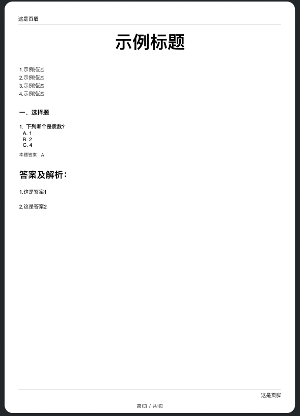

README.md
# @exam-paper/structure

This package defines the core data structures for the entire exam paper application. It uses TypeScript to create robust and type-safe models for papers, questions, answers, and more.

此包为整个试卷应用定义了核心数据结构。它使用 TypeScript 创建了健壮且类型安全的模型，用于描述试卷、问题、答案等。

---

## Data Models

The data models are organized into the following directories:

数据模型按以下目录组织：

| Directory | English Description | 中文描述 |
| :--- | :--- | :--- |
| `answer` | Defines the data structure for answers to questions. | 定义了问题答案的数据结构。 |
| `consts` | Contains constant values and enums used throughout the data models. | 包含整个数据模型中使用的常量和枚举。 |
| `content` | Describes the structure of content blocks, such as text, images, or formulas, that can be used in questions and descriptions. | 描述了内容块的结构，例如可以在问题和描述中使用的文本、图片或公式。 |
| `exams` | Defines the top-level structure for an entire exam, which may contain multiple papers. | 定义了整个考试的顶层结构，其中可能包含多份试卷。 |
| `papers` | Contains the data models for the exam paper itself, including its header, footer, and sections. | 包含试卷本身的数据模型，包括其页眉、页脚和各个部分。 |
| `questions` | Defines the structure for different types of questions (e.g., multiple choice, fill-in-the-blank). | 定义了不同类型问题（如选择题、填空题）的结构。 |
| `shared` | Includes common TypeScript types and interfaces that are shared across different data models. | 包含在不同数据模型之间共享的通用 TypeScript 类型和接口。 |
| `styles` | Defines the data structures for styling information, allowing for customizable rendering of the exam paper. | 定义了用于样式信息的数据结构，允许对试卷进行可定制的渲染。 |

---

## API Reference

### ExamPaperWrapper

`ExamPaperWrapper` 是试卷结构的核心类型，它包装了整个试卷的所有内容。

```ts
interface ExamPaperWrapper<
  Paper extends string = BuiltInPaperNameUnionTypes
> extends TypeWrapper<StructuralType.PAPER, LayoutWrapper<NormalExam>>,
    PaperOption<Paper> {}
```

### 试卷结构示例

#### 最小示例（仅包含必需属性）：

```json
{
  "type": "paper",
  "paper": "A4",
  "value": {
    "layout": {
      // header 页眉
      // title  标题
      // description 描述
      // answer 答案
      // footer 页脚,
      "main": [
        // 标题
        // 描述
        // 问题
        // 空白
        // ...
      ],
    }
  },

}
```

#### 完整示例（包含所有可选属性）：

<details>
  <summary>展开</summary>

  ```json
  {
    "type": "paper",
    "value": {
      "style": {
        "type": "inline",
        "value": {
          "fontSize": "14px",
          "fontFamily": "Arial"
        }
      },
      "layout": {
        "style": {
          "type": "css",
          "value": {
            ".question": {
              "marginBottom": "10px"
            }
          }
        },
        "header": {
          "value": "这是页眉",
          "style": {
            "type": "inline",
            "value": {
              "textAlign": "start"
            }
          }
        },
        "title": {
          "value": "<h1>示例标题</h1>",
          "style": {
            "type": "inline",
            "value": {
              "fontSize": "24px",
              "fontWeight": "bold",
              "textAlign": "center",
              "marginBlockStart": "20px"
            }
          }
        },
        "description": {
          "value": "<p>1.示例描述</p><p>2.示例描述</p><p>3.示例描述</p><p>4.示例描述</p>",
          "style": {
            "type": "css",
            "value": {
              "p": {
                "marginBlock": "2px",
                "color": "gray"
              },
              "p:last-child": {
                "marginBlockEnd": "30px"
              }
            }
          }
        },
        "main": [
          {
            "type": "title",
            "value": {
              "value": "<h3>一、选择题</h3>",
              "style": {
                "type": "inline",
                "value": {
                  "fontWeight": "bold"
                }
              }
            }
          },
          {
            "type": "question",
            "value": {
              "type": "choice-single",
              "orderNumber": "1.",
              "title": {
                "value": "下列哪个是质数？",
                "style": {
                  "type": "inline",
                  "value": {
                    "fontWeight": "bold"
                  }
                }
              },
              "options": [
                {
                  "value": "A. 1",
                  "style": {
                    "type": "inline",
                    "value": {
                      "marginLeft": "10px"
                    }
                  }
                },
                {
                  "value": "B. 2",
                  "style": {
                    "type": "inline",
                    "value": {
                      "marginLeft": "10px"
                    }
                  }
                },
                {
                  "value": "C. 4",
                  "style": {
                    "type": "inline",
                    "value": {
                      "marginLeft": "10px"
                    }
                  }
                }
              ],
              "answer": {
                "type": "answer",
                "value": {
                  "value": "本题答案：A",
                  "style": {
                    "type": "inline",
                    "value": {
                      "color": "gray",
                      "fontSize": "12px",
                      "marginBlock": "10px"
                    }
                  }
                }
              }
            }
          },
          {
            "type": "blank",
            "style": {
              "type": "inline",
              "value": {
                "height": "20px"
              }
            }
          },
          {
            "type": "title",
            "value": {
              "value": "答案及解析：",
              "style": {
                "type": "inline",
                "value": {
                  "fontSize": "24px",
                  "fontWeight": "bold"
                }
              }
            }
          }
        ],
        "answer": [
          {
            "type": "answer",
            "value": {
              "value": "1.这是答案1",
              "style": {
                "type": "inline",
                "value": {
                  "marginTop": "20px"
                }
              }
            }
          },
          {
            "value": "2.这是答案2",
            "style": {
              "type": "inline",
              "value": {
                "marginTop": "20px"
              }
            }
          }
        ],
        "footer": {
          "value": "这是页脚",
          "style": {
            "type": "inline",
            "value": {
              "textAlign": "right"
            }
          }
        }
      }
    },
    "paper": "A4",
    "direction": "portrait",
    "pagination": {
      "style": {
        "color": "gray",
        "fontSize": "12px"
      },
      "formatter": "'第' %current '页 / 共' %total '页'",
      "position": "bottom-center"
    }
  }
  ```
  渲染结果：

  

</details>

#### 渲染示例

- 1.[preview.pdf](../renderer/assets/preview.pdf)
- 2.[example.pdf](../renderer/assets/example.pdf)

